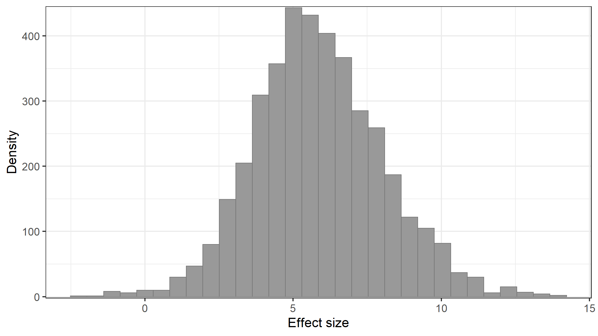

```{r setup, include=FALSE}
library(cowplot)
library(kableExtra)
knitr::opts_chunk$set(echo = F, messages =F, warning=F)

```


<table>
  <tr>
    <th>[Drive and Speak](https://audreyburki.github.io/Drive-and-Speak/)</th>
    <th>[On-line data collection](https://audreyburki.github.io/Online-Data-Collection/)</th>
    <th>[Meta-analyses](https://audreyburki.github.io/Meta-analyses-WordProduction/)</th>
  </tr>
    <tr>
        <td></td>
        <td></td>
        <td></td>
    </tr>
</table>

